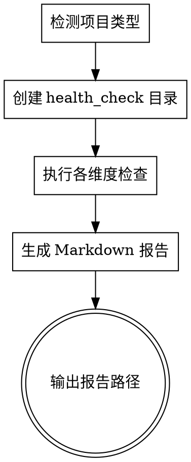

# Health - 项目健康检查

## Overview

Health 是一个全面的项目体检工具，自动检测代码质量、安全性、依赖管理、测试覆盖等11个维度，生成结构化 Markdown 报告。

## When to Use

- 新项目接手时需要全面了解代码状况
- 定期项目体检（建议每季度一次）
- 代码审查前快速扫描潜在问题
- 技术债务评估和量化
- 安全漏洞扫描

**When NOT to use:**
- 简单的 lint 或 format 检查（用专用工具）
- 单一功能调试（用调试技能）

## 检查维度

| 维度 | 检查项 | 优先级 |
|------|--------|--------|
| 代码结构 | 重复代码、大文件、长函数、类复杂度、循环依赖 | P0 |
| 命名规范 | 变量命名、命名风格一致性、类/函数命名规范 | P0 |
| 注释质量 | 注释覆盖率、TODO/FIXME、过期注释 | P1 |
| 代码质量 | 嵌套层级、Magic Number/String、死代码、未使用变量 | P0 |
| 代码抽象 | 雷同代码、重复代码、状态竞争、接口/API 参数完整度，需要抽象出类而没有抽象 | P1 |
| 错误处理 | 异常处理、错误日志、边界检查 | P1 |
| 安全性 | 硬编码密钥、输入校验、SQL/XSS 风险 | P0 |
| 依赖管理 | 过期依赖、安全漏洞、未使用依赖 | P0 |
| 性能问题 | N+1查询、不必要计算、大对象创建 | P1 |
| 测试质量 | 测试覆盖率、测试有效性、测试命名 | P0 |
| 工程规范 | Lint/Format、Git提交、CI/CD配置 | P1 |
| 文档可维护性 | README、架构文档、API文档、CHANGELOG | P1 |

## 执行流程



## Implementation

### 1. 检测项目类型

```bash
# 检查特征文件
Node.js: package.json 存在
Python: requirements.txt 或 pyproject.toml 或 setup.py 存在
Go: go.mod 存在
Java: pom.xml 或 build.gradle 存在
Ruby: Gemfile 存在
PHP: composer.json 存在
Rust: Cargo.toml 存在
```

### 2. 创建检查目录

```bash
mkdir -p ./health_check

# 生成带自增编号的报告文件名
generate_report_filename() {
  local date_str=$(date +%Y-%m-%d)  # 2026-03-16
  local max_num=0

  # 检查当天已存在的报告
  for file in ./health_check/${date_str}-*-health-check.md 2>/dev/null; do
    if [ -f "$file" ]; then
      local num=$(basename "$file" | grep -oE '^[0-9]{4}-[0-9]{1,2}-[0-9]{1,2}-[0-9]{3}' | tail -1 | cut -d'-' -f4)
      if [[ "$num" =~ ^[0-9]+$ ]] && [ "$num" -gt "$max_num" ]; then
        max_num="$num"
      fi
    fi
  done

  local next_num=$(printf "%03d" $((max_num + 1)))
  echo "./health_check/${date_str}-${next_num}-health-check.md"
}

REPORT_FILE=$(generate_report_filename)
echo "报告将保存至: $REPORT_FILE"
```

### 3. 执行检查

**代码结构检查:**

```javascript
// 使用 Agent 并行检查
const checks = {
  duplicateCode: checkDuplicateCode(),     // Agent 分析相似代码块
  largeFiles: checkFileSize(),             // 统计 >500行的文件
  longFunctions: checkFunctionLength(),    // 正则提取函数长度
  classComplexity: checkClassComplexity(), // Agent 分析方法数/属性数
  circularDeps: checkCircularDeps()        // Agent 分析导入关系
};
```

**命名规范检查:**

```javascript
const namingChecks = {
  styleConsistency: checkNamingStyle(),    // camelCase vs snake_case 一致性
  classNaming: checkClassNaming(),         // PascalCase 检查
  constantNaming: checkConstantNaming(),   // UPPER_SNAKE_CASE 检查
  abbreviationUse: checkAbbreviations()    // 缩写使用规范性
};
```

**安全性检查:**

```javascript
const securityChecks = {
  hardcodedSecrets: scanSecrets(),         // 检测密钥、token、密码
  sqlInjection: checkSQLInjection(),       // 字符串拼接 SQL
  xssVulnerabilities: checkXSS(),          // 未转义输出
  inputValidation: checkInputValidation()  // 缺乏输入校验
};
```

**依赖安全检查:**

```bash
# Node.js
npm audit --json 2>/dev/null || yarn audit --json 2>/dev/null

# Python
pip-audit --format=json 2>/dev/null || safety check --json 2>/dev/null

# Go
govulncheck -json ./... 2>/dev/null
```

**测试覆盖率检查:**

```bash
# 检查测试配置文件
coverage_report=$(find . -name "coverage.*" -o -name ".nyc_output" -o -name "htmlcov" 2>/dev/null | head -5)
```

### 4. 生成报告

**报告路径格式:** `./health_check/YYYY-M-D-NNN-health-check.md`

**编号规则（自动累加）:**

```bash
# 获取今日日期
date_str=$(date +%Y-%m-%d)  # 例如: 2026-03-16

# 查找当天已存在的报告，获取下一个可用编号
get_next_number() {
  local date_prefix="$1"
  local max_num=0

  # 查找当天所有报告文件
  for file in ./health_check/${date_prefix}-*-health-check.md; do
    if [ -f "$file" ]; then
      # 提取编号 (YYYY-M-D-NNN-health-check.md -> NNN)
      num=$(echo "$file" | grep -oE '[0-9]{3}-health-check\.md$' | cut -d'-' -f1)
      if [ "$num" -gt "$max_num" ] 2>/dev/null; then
        max_num="$num"
      fi
    fi
  done

  # 下一个编号 = 最大值 + 1，格式化为3位数字
  printf "%03d" $((max_num + 1))
}

# 生成文件名
number=$(get_next_number "$date_str")
report_file="./health_check/${date_str}-${number}-health-check.md"
```

**报告结构:**

```markdown
# 项目健康检查报告

## 执行摘要
- **检查时间**: 2026-04-03
- **项目类型**: Node.js
- **文件总数**: 150
- **代码行数**: 12,000
- **总体评分**: 72/100
- **问题统计**: 15 高 | 28 中 | 45 低

## 详细检查结果

### 1. 代码结构

| 检查项 | 状态 | 严重程度 | 详情 | 建议 |
|--------|------|----------|------|------|
| 重复代码 | ❌ 发现问题 | 高 | 发现 3 处重复代码块 | 提取公共函数 |
| 大文件 | ⚠️ 警告 | 中 | 5 个文件 >500 行 | 考虑拆分模块 |
| 长函数 | ❌ 发现问题 | 高 | 12 个函数 >50 行 | 提取子函数 |
| 类复杂度 | ✅ 通过 | - | 平均方法数: 8 | - |
| 循环依赖 | ✅ 通过 | - | 未发现循环依赖 | - |

### 2. 命名规范
...

## 优先级问题列表

### P0 - 必须修复
1. [security] src/auth.js:15 - 硬编码 API 密钥
2. [code-quality] src/utils.js:45 - 函数 processData 长达 120 行

### P1 - 建议修复
...

## 修复建议

1. **安全漏洞**: 使用环境变量存储敏感信息
2. **代码结构**: 将大函数拆分为单一职责的小函数
...
```

## Quick Reference

### 触发方式

```bash
/health                    # 执行完整健康检查
/health --focus=security   # 仅检查安全性
/health --focus=performance # 仅检查性能
```

### 输出文件

- 路径: `./health_check/YYYY-M-D-NNN-health-check.md`
- **编号规则**:
  - 从 `001` 起始，自动累加
  - 如果当天已存在 `001`，则使用 `002`，以此类推
  - 编号格式：3位数字，不足补零（001, 002, ..., 999）

### 评分标准

| 分数 | 等级 | 说明 |
|------|------|------|
| 90-100 | 🟢 优秀 | 代码健康，可维护性高 |
| 70-89  | 🟡 良好 | 存在少量问题，建议修复 |
| 50-69  | 🟠 一般 | 存在较多问题，需要关注 |
| 0-49   | 🔴 差 | 问题严重，优先修复 |

## Common Mistakes

**Don't:**
- 忽略 P0 级别的安全问题
- 只检查一次，不再跟踪
- 生成报告后不采取行动

**Do:**
- 优先修复 P0 问题
- 定期重新检查（建议每季度）
- 将修复任务分配给具体负责人

## Real-World Impact

- **平均发现**: 每个中等规模项目约 30-50 个可改进点
- **安全风险**: 约 60% 的项目存在硬编码密钥问题
- **技术债务**: 量化评分帮助制定重构计划
