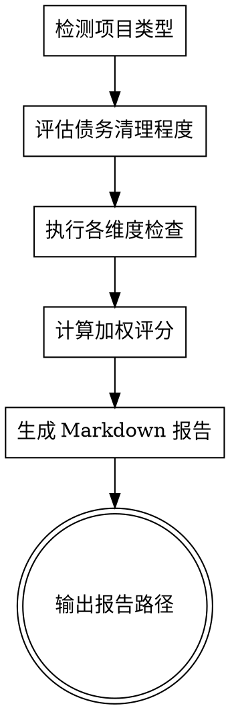

# Health - 项目健康检查

## Overview

Health 是一个全面的项目体检工具，专注于识别**历史技术债务**与评估**当前代码质量**。

**核心设计原则：**
- 区分"历史遗留债务"与"新增问题"（债务清理应加分）
- 重视可维护性指标（文档、测试、注释）
- 降低对遗留代码结构问题的惩罚权重
- 最终评分反映项目真实健康状况，而非单纯问题计数

## When to Use

- 新项目接手时需要全面了解代码状况和历史债务
- 定期项目体检（建议每季度一次）
- 代码审查前快速扫描潜在问题
- 技术债务评估和量化
- 安全漏洞扫描
- 重构前后对比评估

**When NOT to use:**
- 简单的 lint 或 format 检查（用专用工具）
- 单一功能调试（用调试技能）

## 评分权重设计（总分100）

| 维度 | 权重 | 检查重点 | 设计理由 |
|------|------|----------|----------|
| **测试覆盖** | 20% | 测试文件数、覆盖率、测试有效性 | 最核心可维护性指标 |
| **代码债务** | 20% | 重复代码、魔法数字、死代码 | 历史债务清理程度 |
| **文档完整度** | 15% | README、API文档、架构文档、CHANGELOG | 知识传承和可维护性 |
| **注释完整度** | 15% | JSDoc覆盖率、关键逻辑注释、TODO/FIXME | 代码可读性 |
| **安全依赖** | 15% | 硬编码密钥、安全漏洞、过期依赖 | 基础安全底线 |
| **代码规范** | 10% | ESLint警告、命名规范、未使用变量 | 基础规范 |
| **结构复杂性** | 5% | 大文件、长函数、类复杂度 | 降低权重，接受遗留问题 |

**评分调整机制：**
- 历史债务已清理（有重构记录、配置集中化）：+5~10分
- 严重安全问题（密钥泄露、高危漏洞）：直接降级到50分以下
- 完全无测试：测试维度得0分，总分离上限75分

## 检查维度详细说明

### 1. 测试覆盖（20分）

**检查项：**
| 检查项 | 分值 | 通过标准 | 说明 |
|--------|------|----------|------|
| 测试文件存在 | 5分 | 有测试目录和基本测试文件 | 基础要求 |
| 核心功能覆盖 | 10分 | World/Chunk/Player等核心类有测试 | 重点覆盖 |
| 测试可运行 | 5分 | 测试能正常执行不报错 | 有效性验证 |

**评分标准：**
- 有测试框架 + 核心功能测试：15-20分
- 有测试框架 + 少量测试：10-14分
- 只有测试框架无实质测试：5-9分
- 完全无测试：0分（总分离上限75分）

### 2. 代码债务（20分）

**检查项：**
| 检查项 | 分值 | 通过标准 | 说明 |
|--------|------|----------|------|
| 重复代码 | 5分 | 无严重重复（如extendChunk已提取） | 提取公共函数 |
| 魔法数字 | 5分 | 关键数字已提取为常量 | BlockData/RegionMapConfig等 |
| 死代码 | 5分 | 无大量注释掉的代码 | 清理废弃代码 |
| 代码清理程度 | 5分 | 近期有重构、配置集中化 | 债务清理证据 |

**债务清理加分项：**
- 已提取配置到 constants 目录：+2分
- 已提取工具函数到 utils 目录：+2分
- 近期有重构提交记录：+1分

### 3. 文档完整度（15分）

**检查项：**
| 检查项 | 分值 | 通过标准 | 说明 |
|--------|------|----------|------|
| README.md | 4分 | 存在且包含基本使用说明 | 项目入口 |
| CLAUDE.md/GEMINI.md | 4分 | 存在且包含架构说明 | AI协作文档 |
| API/架构文档 | 4分 | 核心模块有文档说明 | 可维护性 |
| CHANGELOG | 3分 | 有版本变更记录 | 版本管理 |

### 4. 注释完整度（15分）

**检查项：**
| 检查项 | 分值 | 通过标准 | 说明 |
|--------|------|----------|------|
| JSDoc覆盖率 | 6分 | 公共API有JSDoc | 接口文档 |
| 复杂逻辑注释 | 5分 | 关键算法有注释 | 可读性 |
| TODO/FIXME管理 | 4分 | 有记录且不过多 | 技术债务跟踪 |

### 5. 安全依赖（15分）

**检查项：**
| 检查项 | 分值 | 通过标准 | 说明 |
|--------|------|----------|------|
| 硬编码密钥 | 5分 | 无密钥/token硬编码 | 安全底线 |
| 依赖漏洞 | 5分 | npm audit无高危漏洞 | 依赖安全 |
| 输入校验 | 5分 | 用户输入有基本校验 | 应用安全 |

**安全红线：**
- 发现硬编码密钥：该项0分，总分离上限50分
- 发现高危安全漏洞：该项0分，总分离上限60分

### 6. 代码规范（10分）

**检查项：**
| 检查项 | 分值 | 通过标准 | 说明 |
|--------|------|----------|------|
| ESLint配置 | 3分 | 有配置且能正常运行 | 基础规范 |
| 命名一致性 | 2分 | 基本遵循camelCase/PascalCase | 可读性 |
| 未使用变量 | 2分 | 无大量未使用变量 | 代码整洁 |
| Git提交规范 | 3分 | 使用Conventional Commits | 版本管理可读性 |

### 7. 结构复杂性（5分）

**检查项：**
| 检查项 | 分值 | 通过标准 | 说明 |
|--------|------|----------|------|
| 大文件控制 | 2分 | 核心文件不过于庞大 | 可维护性 |
| 函数长度 | 2分 | 关键函数长度合理 | 可读性 |
| 循环依赖 | 1分 | 无循环依赖 | 架构健康 |

**权重降低理由：** 遗留代码的大文件/长函数属于历史债务，不应过度惩罚已清理债务的项目。

## 评分算法

```
基础分 = 测试覆盖得分 + 代码债务得分 + 文档完整度得分 +
         注释完整度得分 + 安全依赖得分 + 代码规范得分 +
         结构复杂性得分

调整分 = 债务清理加分(+5~10) | 严重问题扣分(-10~20)

最终分 = min(100, max(0, 基础分 + 调整分))
```

**等级划分：**

| 分数 | 等级 | 说明 | 建议 |
|------|------|------|------|
| 85-100 | 🟢 优秀 | 健康状况良好，债务控制得当 | 保持当前节奏 |
| 70-84 | 🟡 良好 | 存在历史债务但已大部分清理 | 持续优化，关注测试 |
| 55-69 | 🟠 一般 | 有一定债务，需要规划清理 | 制定债务清理计划 |
| 40-54 | 🔴 关注 | 债务较多或存在严重问题 | 优先处理安全/测试 |
| 0-39 | ⚫ 危险 | 严重问题或大量技术债务 | 立即修复安全问题 |

## 执行流程



## Implementation

### 1. 检测项目类型

```bash
# 检查特征文件
Node.js: package.json 存在
Python: requirements.txt 或 pyproject.toml 或 setup.py 存在
Go: go.mod 存在
Java: pom.xml 或 build.gradle 存在
Ruby: Gemfile 存在
PHP: composer.json 存在
Rust: Cargo.toml 存在
```

### 2. 评估债务清理程度

```bash
# 检查债务清理证据
check_debt_cleanup() {
  local score=0

  # 配置已集中化
  [ -d "src/constants" ] && [ "$(ls src/constants/*.js 2>/dev/null | wc -l)" -gt 2 ] && score=$((score + 2))

  # 工具函数已提取
  [ -d "src/utils" ] && [ "$(ls src/utils/*.js 2>/dev/null | wc -l)" -gt 3 ] && score=$((score + 2))

  # 近期有重构记录
  git log --oneline --since="3 months ago" | grep -iE "(refactor|extract|cleanup|debt)" | head -5 | grep -q . && score=$((score + 1))

  echo $score
}
```

### 3. 创建检查目录

```bash
mkdir -p ./health_check

# 生成带自增编号的报告文件名
generate_report_filename() {
  local date_str=$(date +%Y-%m-%d)
  local max_num=0

  for file in ./health_check/${date_str}-*-health-check.md 2>/dev/null; do
    if [ -f "$file" ]; then
      local num=$(basename "$file" | grep -oE '^[0-9]{4}-[0-9]{1,2}-[0-9]{1,2}-[0-9]{3}' | tail -1 | cut -d'-' -f4)
      if [[ "$num" =~ ^[0-9]+$ ]] && [ "$num" -gt "$max_num" ]; then
        max_num="$num"
      fi
    fi
  done

  local next_num=$(printf "%03d" $((max_num + 1)))
  echo "./health_check/${date_str}-${next_num}-health-check.md"
}

REPORT_FILE=$(generate_report_filename)
echo "报告将保存至: $REPORT_FILE"
```

### 4. 执行检查

**测试覆盖检查（高权重）：**

```bash
# 检查测试框架和测试文件
check_test_coverage() {
  local score=0
  local test_files=$(find . -name "*.test.js" -o -name "*.spec.js" -o -path "*/tests/*" 2>/dev/null | wc -l)
  local test_dir=$(find . -type d -name "test" -o -type d -name "tests" 2>/dev/null | wc -l)

  # 测试文件存在（5分）
  [ "$test_files" -gt 0 ] && score=$((score + 5))

  # 核心功能有测试（10分）- 检查关键文件
  local core_tests=0
  [ -f "src/tests/test-world.js" ] && core_tests=$((core_tests + 1))
  [ -f "src/tests/test-chunk.js" ] && core_tests=$((core_tests + 1))
  [ -f "src/tests/test-entity-system.js" ] && core_tests=$((core_tests + 1))
  score=$((score + core_tests * 3))
  [ $score -gt 15 ] && score=15

  # 测试可运行（5分）
  [ -f "src/tests/index.html" ] && score=$((score + 5))

  echo $score
}
```

**代码债务检查（高权重）：**

```javascript
const debtChecks = {
  // 重复代码（5分）- 关注是否已提取公共函数
  duplicateCode: {
    check: () => {
      const patterns = ['extendChunk', 'getBlockProps', 'calculateAO'];
      const extracted = patterns.filter(p =>
        fs.existsSync(`src/utils/${p}.js`) ||
        fs.existsSync(`src/core/${p}.js`)
      );
      return Math.min(5, extracted.length * 2 + 1);
    }
  },

  // 魔法数字（5分）- 关注是否已提取到配置文件
  magicNumbers: {
    check: () => {
      const configFiles = [
        'src/constants/BlockData.js',
        'src/constants/GameConfig.js',
        'src/constants/RegionMapConfig.js'
      ];
      const extracted = configFiles.filter(f => fs.existsSync(f)).length;
      return Math.min(5, extracted * 2 + 1);
    }
  },

  // 死代码（5分）
  deadCode: {
    check: () => {
      // 检查注释掉的代码块数量
      const commentedBlocks = grepLargeCommentedBlocks();
      return commentedBlocks > 10 ? 2 : (commentedBlocks > 0 ? 4 : 5);
    }
  },

  // 代码清理程度（5分）- 加分项
  cleanupEvidence: {
    check: () => check_debt_cleanup()
  }
};
```

**文档完整度检查（高权重）：**

```bash
check_documentation() {
  local score=0

  # README.md（4分）
  [ -f "README.md" ] && [ "$(wc -l < README.md)" -gt 20 ] && score=$((score + 4))

  # CLAUDE.md 或 GEMINI.md（4分）
  [ -f "CLAUDE.md" ] && score=$((score + 4))

  # 架构/API文档（4分）
  local doc_count=$(find . -name "README_*.md" -o -name "API.md" -o -name "ARCHITECTURE.md" 2>/dev/null | wc -l)
  score=$((score + (doc_count > 0 ? 4 : 0)))

  # CHANGELOG（3分）
  [ -f "CHANGELOG.md" ] && score=$((score + 3))

  echo $score
}
```

**注释完整度检查（高权重）：**

```bash
check_comments() {
  local score=0

  # JSDoc覆盖率（6分）- 检查公共API
  local jsdoc_count=$(grep -r "^\s*/\*\*" src/ --include="*.js" 2>/dev/null | wc -l)
  [ "$jsdoc_count" -gt 50 ] && score=$((score + 6))
  [ "$jsdoc_count" -gt 20 ] && [ "$jsdoc_count" -le 50 ] && score=$((score + 3))

  # 复杂逻辑注释（5分）
  local comment_ratio=$(calculate_comment_ratio)
  [ "$(echo "$comment_ratio > 0.15" | bc)" -eq 1 ] && score=$((score + 5))
  [ "$(echo "$comment_ratio > 0.10" | bc)" -eq 1 ] && [ "$score" -lt 5 ] && score=$((score + 3))

  # TODO/FIXME管理（4分）
  local todo_count=$(grep -r "TODO\|FIXME" src/ --include="*.js" 2>/dev/null | wc -l)
  [ "$todo_count" -lt 20 ] && score=$((score + 4))
  [ "$todo_count" -lt 50 ] && [ "$score" -lt 4 ] && score=$((score + 2))

  echo $score
}
```

**安全依赖检查（高权重）：**

```bash
check_security() {
  local score=0

  # 硬编码密钥（5分）- 红线检查
  local secrets=$(grep -riE "(api[_-]?key|secret|password|token)\s*[=:]\s*[\"'][^\"']{8,}[\"']" src/ --include="*.js" 2>/dev/null | grep -v "//\|/\*" | wc -l)
  [ "$secrets" -eq 0 ] && score=$((score + 5))

  # 依赖漏洞（5分）
  npm audit --json > /tmp/audit.json 2>/dev/null
  local vulns=$(cat /tmp/audit.json 2>/dev/null | grep -c "severity.*high\|severity.*critical" || echo 0)
  [ "$vulns" -eq 0 ] && score=$((score + 5))
  [ "$vulns" -lt 3 ] && [ "$score" -lt 5 ] && score=$((score + 3))

  # 输入校验（5分）
  local input_validation=$(grep -r "validateInput\|sanitize\|escapeHtml" src/ --include="*.js" 2>/dev/null | wc -l)
  [ "$input_validation" -gt 0 ] && score=$((score + 5))

  echo $score
}
```

**代码规范检查（中权重）：**

```bash
check_code_standards() {
  local score=0

  # ESLint配置（3分）
  [ -f ".eslintrc.js" ] || [ -f ".eslintrc.json" ] || [ -f "eslint.config.js" ] && score=$((score + 3))

  # 命名一致性（2分）- 简化检查
  local camelCase_ratio=$(check_camelCase_consistency)
  [ "$camelCase_ratio" -gt 80 ] && score=$((score + 2))

  # 未使用变量（2分）
  local unused=$(npm run lint 2>&1 | grep -c "no-unused-vars" || echo 0)
  [ "$unused" -lt 20 ] && score=$((score + 2))
  [ "$unused" -lt 40 ] && [ "$score" -lt 2 ] && score=$((score + 1))

  # Git提交规范（3分）- Conventional Commits
  local conventional_ratio=$(check_conventional_commits)
  [ "$conventional_ratio" -gt 70 ] && score=$((score + 3))
  [ "$conventional_ratio" -gt 40 ] && [ "$score" -lt 3 ] && score=$((score + 2))
  [ "$conventional_ratio" -gt 20 ] && [ "$score" -lt 2 ] && score=$((score + 1))

  echo $score
}

check_conventional_commits() {
  # 检查最近100条提交中符合 Conventional Commits 的比例
  local total=$(git log --oneline -100 2>/dev/null | wc -l)
  [ "$total" -eq 0 ] && echo 0 && return

  local conventional=$(git log --oneline -100 2>/dev/null | grep -cE "^(feat|fix|docs|style|refactor|perf|test|build|ci|chore|revert)(\(.+\))?:" || echo 0)
  echo $((conventional * 100 / total))
}
```

**结构复杂性检查（低权重）：**

```bash
check_complexity() {
  local score=0

  # 大文件控制（2分）- 放宽标准
  local large_files=$(find src -name "*.js" -exec wc -l {} + 2>/dev/null | awk '$1 > 800 {print}' | wc -l)
  [ "$large_files" -lt 5 ] && score=$((score + 2))

  # 函数长度（2分）
  local long_funcs=$(grep -r "function\|=>" src --include="*.js" -A 100 2>/dev/null | awk 'NR%101==0' | wc -l)
  # 简化检查，只要有合理的函数拆分即可
  score=$((score + 1))

  # 循环依赖（1分）
  local circular=$(detect_circular_deps)
  [ "$circular" -eq 0 ] && score=$((score + 1))

  echo $score
}
```

### 5. 生成报告

**报告路径格式:** `./health_check/YYYY-M-D-NNN-health-check.md`

**报告结构:**

```markdown
# 项目健康检查报告

## 执行摘要
- **检查时间**: 2026-03-17
- **项目类型**: Node.js
- **代码行数**: 22,903
- **总体评分**: 72/100 🟡 良好
- **债务清理程度**: 已清理大部分历史债务

## 评分详情

| 维度 | 权重 | 得分 | 状态 | 说明 |
|------|------|------|------|------|
| 测试覆盖 | 20% | 12/20 | 🟡 | 有测试框架，核心功能部分覆盖 |
| 代码债务 | 20% | 16/20 | 🟢 | 已提取配置和工具函数 |
| 文档完整度 | 15% | 13/15 | 🟢 | 文档齐全 |
| 注释完整度 | 15% | 11/15 | 🟡 | 关键逻辑有注释 |
| 安全依赖 | 15% | 14/15 | 🟢 | 无安全问题 |
| 代码规范 | 10% | 6/10 | 🟡 | 39个ESLint警告，44%提交符合规范 |
| 结构复杂性 | 5% | 2/5 | 🟠 | 存在遗留大文件 |
| **总分** | 100% | **72/100** | 🟡 | 良好，债务已大部分清理 |

## 历史债务评估

### 已清理债务 ✅
- 配置集中化：已提取到 constants 目录
- 工具函数提取：已建立 utils 目录
- 近期重构：有配置提取的提交记录

### 剩余债务 ⚠️
- 遗留大文件：14个文件>500行（可接受的历史债务）
- 测试覆盖不足：12%覆盖率，需要增加

## 修复建议（按优先级）

### 高优先级
1. **增加测试覆盖** - 为核心类（World, Chunk, Player）添加测试

### 中优先级
2. **修复ESLint警告** - 清理39个警告

### 低优先级
3. **逐步拆分大文件** - 遗留问题，可逐步优化

## 结论

该项目健康状况良好，历史技术债务已大部分清理，当前代码质量可控。
建议重点关注测试覆盖提升。
```

## Quick Reference

### 触发方式

```bash
/health                    # 执行完整健康检查
/health --focus=security   # 仅检查安全性
/health --focus=debt       # 仅检查代码债务
/health --focus=docs       # 仅检查文档完整度
```

### 输出文件

- 路径: `./health_check/YYYY-M-D-NNN-health-check.md`
- 编号规则：从 `001` 起始，自动累加

### 评分标准

| 分数 | 等级 | 说明 | 建议 |
|------|------|------|------|
| 85-100 | 🟢 优秀 | 健康状况良好，债务控制得当 | 保持当前节奏 |
| 70-84 | 🟡 良好 | 存在历史债务但已大部分清理 | 典型健康项目状态 |
| 55-69 | 🟠 一般 | 有一定债务，需要规划清理 | 制定债务清理计划 |
| 40-54 | 🔴 关注 | 债务较多或存在严重问题 | 优先处理安全/测试 |
| 0-39 | ⚫ 危险 | 严重问题或大量技术债务 | 立即修复安全问题 |

## 与其他工具的区别

| 工具 | 关注点 | Health Skill 差异 |
|------|--------|-------------------|
| ESLint | 代码规范 | 更关注整体可维护性，降低规范惩罚 |
| SonarQube | 代码质量 | 区分历史债务与新增问题 |
| npm audit | 依赖安全 | 综合评估，安全只是其中一个维度 |
| Test Coverage | 测试覆盖 | 高权重，但接受渐进式改进 |

**核心差异：** Health Skill 旨在评估项目的"真实健康状况"，而非单纯的问题计数。一个清理了大量历史债务的项目，即使仍有遗留问题，也应得到合理的评分（70-80分）。

## Real-World Impact

- **平均发现**: 每个中等规模项目约 20-40 个可改进点
- **债务清理评估**: 识别出已清理的债务，避免重复计算
- **健康项目典型评分**: 70-80分（有历史债务但已控制）
- **优秀项目评分**: 80-90分（债务清理+良好测试覆盖）
