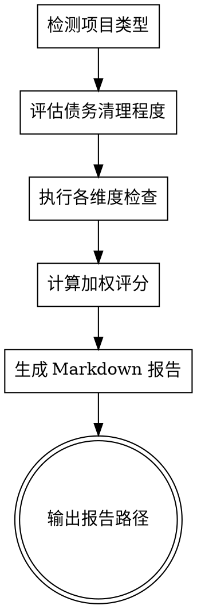

# Health - 项目健康检查

## Overview

Health 是一个全面的项目体检工具，专注于识别**历史技术债务**与评估**当前代码质量**。

**支持项目类型：**
- Node.js / JavaScript / TypeScript
- Flutter / Dart
- Python / Go / Java / Ruby / PHP / Rust
- **iOS / Objective-C / Swift** (新增)

**核心设计原则：**
- 区分"历史遗留债务"与"新增问题"（债务清理应加分）
- 重视可维护性指标（文档、测试、注释）
- 降低对遗留代码结构问题的惩罚权重
- 最终评分反映项目真实健康状况，而非单纯问题计数

**iOS 项目特别关注点：**
- 头文件注释完整度（公共 API 文档）
- 代码组织（Utils/Categories/Constants 目录结构）
- 内存管理规范（ARC 合规性）
- 命名规范（Objective-C 编码约定）
- 静态分析工具配置（SwiftLint/OCLint）

## When to Use

- 新项目接手时需要全面了解代码状况和历史债务
- 定期项目体检（建议每季度一次）
- 代码审查前快速扫描潜在问题
- 技术债务评估和量化
- 安全漏洞扫描
- 重构前后对比评估

**When NOT to use:**
- 简单的 lint 或 format 检查（用专用工具）
- 单一功能调试（用调试技能）

## 评分权重设计（总分100）

| 维度 | 权重 | 检查重点 | 设计理由 |
|------|------|----------|----------|
| **测试覆盖** | 15% | 测试文件数、XCTest覆盖、UI测试 | 核心可维护性指标 |
| **代码债务** | 15% | 重复代码、魔法数字、死代码、代码组织 | 历史债务清理程度 |
| **文档完整度** | 10% | README、API文档、架构文档、CHANGELOG | 知识传承和可维护性 |
| **注释完整度** | 10% | 头文件注释、实现注释、TODO/FIXME | 代码可读性 |
| **安全依赖** | 10% | 硬编码密钥、Pod版本、输入校验 | 基础安全底线 |
| **代码规范** | 8% | SwiftLint/OCLint、命名规范、内存管理 | 基础规范 |
| **结构复杂性** | 3% | 大文件、长方法、头文件依赖 | 降低权重，接受遗留问题 |
| **架构设计质量** | 12% | 分层架构、跨层调用、设计模式滥用 | 架构可维护性 |
| **技术栈健康度** | 8% | 框架一致性、版本管理、依赖数量 | 技术栈一致性 |
| **性能健康度** | 5% | 算法复杂度、查询性能、内存管理 | 运行时质量 |
| **错误处理质量** | 3% | 异常处理完整性、错误信息质量 | 系统稳定性 |
| **可观测性** | 3% | 监控配置、日志系统、追踪机制 | 问题排查效率 |

**v2.0 更新说明：**
- 新增架构设计质量、技术栈健康度、性能健康度、错误处理质量、可观测性 5 个维度
- 调整现有维度权重，总分保持 100 分制

**评分调整机制：**
- 历史债务已清理（有重构记录、配置集中化）：+5~10分
- 严重安全问题（密钥泄露、高危漏洞）：直接降级到50分以下
- 完全无测试：测试维度得0分，总分离上限75分
- **大量废代码/死代码**：-5~15分（根据未引用代码比例）
- **多人协作风格不一致**：-3~10分（根据命名/格式混乱程度）
- **完全没有测试用例**：-10分（强制扣分，与测试维度得分独立）

## 检查维度详细说明

### 1. 测试覆盖（20分）

**通用检查项：**
| 检查项 | 分值 | 通过标准 | 说明 |
|--------|------|----------|------|
| 测试文件存在 | 5分 | 有测试目录和基本测试文件 | 基础要求 |
| 核心功能覆盖 | 10分 | 核心类/模块有测试 | 重点覆盖 |
| 测试可运行 | 5分 | 测试能正常执行不报错 | 有效性验证 |

**iOS 特定检查项：**
| 检查项 | 分值 | 通过标准 | 说明 |
|--------|------|----------|------|
| XCTest框架 | 5分 | 有 Tests 目录和测试文件 | XCTest单元测试 |
| 单元测试覆盖 | 10分 | 核心类有对应*Tests.m文件 | 业务逻辑测试 |
| UI测试 | 5分 | 有 UITests 目录 | 界面流程测试 |

**测试文件命名规范：**
```
ProjectNameTests/
  ├── ModelTests.m          // 数据模型测试
  ├── ServiceTests.m        // 服务层测试
  └── ViewModelTests.m      // ViewModel测试
ProjectNameUITests/
  └── LoginFlowTests.m      // UI流程测试
```

**评分标准：**
- 有XCTest + 核心功能测试：15-20分
- 有XCTest + 少量测试：10-14分
- 只有测试目录无实质测试：5-9分
- 完全无测试：0分（总分离上限75分）

### 2. 代码债务（20分）

**通用检查项：**
| 检查项 | 分值 | 通过标准 | 说明 |
|--------|------|----------|------|
| 重复代码 | 5分 | 无严重重复（如extendChunk已提取） | 提取公共函数 |
| 魔法数字 | 5分 | 关键数字已提取为常量 | BlockData/RegionMapConfig等 |
| 死代码 | 5分 | 无大量注释掉的代码 | 清理废弃代码 |
| 代码清理程度 | 5分 | 近期有重构、配置集中化 | 债务清理证据 |

**iOS 特定检查项：**
| 检查项 | 分值 | 通过标准 | 说明 |
|--------|------|----------|------|
| 重复代码 | 5分 | 工具方法已提取到 Categories/Utils | 消除重复逻辑 |
| 魔法数字 | 5分 | 常量已定义在 Constants/Configs | 配置集中化 |
| 死代码 | 5分 | 无大量注释掉的OC方法 | 清理废弃代码 |
| 代码组织 | 5分 | 有 Utils/Helpers/Categories 目录 | 债务清理证据 |

**iOS 债务清理加分项：**
- 已提取配置到 Constants/Configs 目录：+2分
- 已提取工具函数到 Utils/Helpers/Categories 目录：+2分
- 近期有重构提交记录（refactor/cleanup/extract）：+1分

**典型的iOS代码组织：**
```
Src/
├── Constants/          // 常量定义
│   ├── APIConfig.h
│   └── UIConstants.h
├── Utils/             // 工具方法
│   ├── StringUtils.h/.m
│   └── DateUtils.h/.m
├── Categories/        // 分类扩展
│   ├── NSString+Helper.h/.m
│   └── UIView+Layout.h/.m
└── ...
```

### 3. 文档完整度（15分）

**检查项：**
| 检查项 | 分值 | 通过标准 | 说明 |
|--------|------|----------|------|
| README.md | 4分 | 存在且包含基本使用说明 | 项目入口 |
| CLAUDE.md/GEMINI.md | 4分 | 存在且包含架构说明 | AI协作文档 |
| API/架构文档 | 4分 | 核心模块有文档说明 | 可维护性 |
| CHANGELOG | 3分 | 有版本变更记录 | 版本管理 |

### 4. 注释完整度（15分）

**通用检查项：**
| 检查项 | 分值 | 通过标准 | 说明 |
|--------|------|----------|------|
| API文档覆盖率 | 6分 | 公共API有文档注释 | 接口文档 |
| 复杂逻辑注释 | 5分 | 关键算法有注释 | 可读性 |
| TODO/FIXME管理 | 4分 | 有记录且不过多 | 技术债务跟踪 |

**iOS 特定检查项：**
| 检查项 | 分值 | 通过标准 | 说明 |
|--------|------|----------|------|
| 头文件注释 | 6分 | 头文件中有类/方法文档 | 公共接口文档 |
| 实现文件注释 | 5分 | 复杂逻辑有说明 | 代码可读性 |
| TODO/FIXME/HACK | 4分 | 有记录且不过多(<50) | 技术债务跟踪 |

**注释规范示例：**
```objc
// 良好的头文件注释
/**
 * 处理用户登录逻辑的管理器类
 * 支持多种登录方式：手机号、邮箱、第三方
 */
@interface LoginManager : NSObject

/**
 * 执行用户登录
 * @param credentials 用户凭证信息
 * @param completion 登录完成回调
 * @return 登录请求ID，可用于取消
 */
- (NSString *)loginWithCredentials:(Credentials *)credentials
                        completion:(void (^)(Result *))completion;

@end
```

### 5. 安全依赖（15分）

**通用检查项：**
| 检查项 | 分值 | 通过标准 | 说明 |
|--------|------|----------|------|
| 硬编码密钥 | 5分 | 无密钥/token硬编码 | 安全底线 |
| 依赖漏洞 | 5分 | 无高危漏洞 | 依赖安全 |
| 输入校验 | 5分 | 用户输入有基本校验 | 应用安全 |

**iOS 特定检查项：**
| 检查项 | 分值 | 通过标准 | 说明 |
|--------|------|----------|------|
| 硬编码密钥 | 5分 | 代码/Plist中无API密钥/Token | 安全底线 |
| Pod依赖版本 | 5分 | Podfile中依赖使用具体版本 | 依赖安全 |
| 输入验证 | 5分 | 有用户输入校验逻辑 | 应用安全 |

**iOS 安全检查重点：**
```objc
// 危险：硬编码密钥
static NSString *kAPIKey = @"sk_live_1234567890abcdef";  // ❌ 扣分项

// 推荐：从配置或Keychain读取
static NSString *kAPIKey = CONFIG.apiKey;  // ✅ 正确做法
```

**安全红线：**
- 发现硬编码密钥：该项0分，总分离上限50分
- 发现高危安全漏洞：该项0分，总分离上限60分

### 6. 代码规范（10分）

**通用检查项：**
| 检查项 | 分值 | 通过标准 | 说明 |
|--------|------|----------|------|
| Lint配置 | 3分 | 有配置且能正常运行 | ESLint/Prettier/SwiftLint等 |
| 命名一致性 | 2分 | 遵循语言命名规范 | 可读性 |
| 未使用变量 | 2分 | 无大量未使用变量 | 代码整洁 |
| Git提交规范 | 3分 | 使用Conventional Commits | 版本管理可读性 |

**iOS 特定检查项：**
| 检查项 | 分值 | 通过标准 | 说明 |
|--------|------|----------|------|
| 静态分析配置 | 3分 | 有 SwiftLint/OCLint/.clang-format | 基础规范 |
| Objective-C命名规范 | 2分 | 类名大写开头，方法小写开头 | Apple编码规范 |
| 内存管理规范 | 2分 | ARC项目无retain/release混用 | 现代OC标准 |
| Git提交规范 | 3分 | 符合Conventional Commits | 版本管理 |

### 7. 结构复杂性（5分）

**检查项：**
| 检查项 | 分值 | 通过标准 | 说明 |
|--------|------|----------|------|
| 大文件控制 | 2分 | 核心文件不过于庞大 | 可维护性 |
| 函数长度 | 2分 | 关键函数长度合理 | 可读性 |
| 循环依赖 | 1分 | 无循环依赖 | 架构健康 |

**iOS 特定检查：**
- 大文件标准：.m/.mm文件超过800行视为大文件
- 方法长度：单方法超过100行视为过长
- 头文件依赖：检查是否使用`@class`前向声明减少耦合

**权重降低理由：** 遗留代码的大文件/长函数属于历史债务，不应过度惩罚已清理债务的项目。

### 8. 架构设计质量（12分）【新增】

**检查项：**
| 检查项 | 分值 | 通过标准 | 说明 |
|--------|------|----------|------|
| 分层架构规范 | 4分 | 有清晰的分层目录结构 | MVC/MVVM/分层架构 |
| 跨层调用检测 | 3分 | 无不合理的跨层调用 | Controller不直接访问DB |
| 设计模式滥用 | 3分 | 单例不过多、无过度设计 | 合理使用设计模式 |
| 模块耦合度 | 2分 | 模块耦合度合理 | import数量不过多 |

**Python 分层架构检查：**
```
app/
├── controller/     # 控制层 - 处理HTTP请求
├── service/        # 服务层 - 业务逻辑
├── model/          # 数据层 - 数据模型
├── agent/          # Agent层 - AI代理
├── prompt/         # Prompt层 - 提示词
├── utils/          # 工具层 - 通用工具
└── common/         # 公共层 - 常量/配置
```

**常见问题：**
- Model 层反向导入 Controller/Service（❌）
- Utils 层依赖业务层（❌）
- 过多单例模式（>5个需评估）
- 模块 import 数量过多（>20个需关注）

### 9. 技术栈健康度（8分）【新增】

**检查项：**
| 检查项 | 分值 | 通过标准 | 说明 |
|--------|------|----------|------|
| 框架一致性 | 3分 | 无混用相似框架 | React/Vue二选一 |
| 版本管理质量 | 2分 | 依赖版本统一锁定 | 有lock文件 |
| 依赖数量评估 | 2分 | 依赖数量合理（<30） | 避免依赖膨胀 |
| 技术选型合理性 | 1分 | 技术栈与项目规模匹配 | 小项目不用微服务 |

**Python 框架一致性检查：**
- Web框架：Flask/Django/FastAPI 不应混用
- ORM：SQLAlchemy/Peewee/Django ORM 不应混用
- HTTP客户端：requests/httpx/urllib 不应过多混用

**版本管理检查：**
- 检查 requirements.txt 是否有版本范围声明（>=, ~=）
- 检查是否有 requirements.lock 或 poetry.lock
- 检查未锁定版本的依赖

### 10. 性能健康度（5分）【新增】

**检查项：**
| 检查项 | 分值 | 通过标准 | 说明 |
|--------|------|----------|------|
| 算法复杂度风险 | 2分 | 无深层嵌套循环 | 嵌套<3层 |
| 查询性能风险 | 2分 | 无循环内数据库调用 | 避免N+1问题 |
| 内存管理风险 | 1分 | 无循环内大对象创建 | 使用生成器 |

**性能问题检测：**
```python
# ❌ 循环内数据库查询（N+1问题）
for user in users:
    order = db.query(f"SELECT * FROM orders WHERE user_id = {user.id}")

# ✅ 批量查询
user_ids = [u.id for u in users]
orders = db.query(f"SELECT * FROM orders WHERE user_id IN ({user_ids})")

# ❌ 循环内大对象创建
results = []
for i in range(100000):
    results.append([0] * 1000)  # 大列表

# ✅ 使用生成器
def generate_results():
    for i in range(100000):
        yield [0] * 1000
```

### 11. 错误处理质量（3分）【新增】

**检查项：**
| 检查项 | 分值 | 通过标准 | 说明 |
|--------|------|----------|------|
| 异常处理完整性 | 1分 | 关键操作有try-catch | 文件/网络/DB操作 |
| 错误信息质量 | 1分 | 错误信息有足够上下文 | 包含变量信息 |
| 日志记录 | 1分 | 异常块有日志记录 | logging.error/exception |

**错误处理检查：**
```python
# ❌ 空 except 块
try:
    do_something()
except:
    pass

# ✅ 合理的异常处理
try:
    do_something()
except SpecificError as e:
    logger.error(f"操作失败: {e}", exc_info=True)
    raise
```

### 12. 可观测性（3分）【新增】

**检查项：**
| 检查项 | 分值 | 通过标准 | 说明 |
|--------|------|----------|------|
| 监控配置 | 1分 | 有性能/错误监控配置 | Sentry/Prometheus等 |
| 日志系统 | 1分 | 有结构化日志配置 | logging模块使用 |
| 追踪机制 | 1分 | 有请求追踪机制 | TraceID/RequestID |

**可观测性工具检测：**
- 错误监控：Sentry、Datadog、NewRelic
- 性能监控：Prometheus、OpenTelemetry
- 日志系统：logging、loguru、structlog

## 评分算法

```
基础分 = 测试覆盖得分(15) + 代码债务得分(15) + 文档完整度得分(10) +
         注释完整度得分(10) + 安全依赖得分(10) + 代码规范得分(8) +
         结构复杂性得分(3) + 架构设计质量得分(12) + 技术栈健康度得分(8) +
         性能健康度得分(5) + 错误处理质量得分(3) + 可观测性得分(3)

调整分 = 债务清理加分(+5~10)
       | 严重问题扣分(-10~20)
       | 废代码扣分(-5~15, 未引用代码>10%)
       | 风格不一致扣分(-3~10, 多人协作项目)
       | 无测试用例扣分(-10, 测试文件数为0)

最终分 = min(100, max(0, 基础分 + 调整分))
```

**等级划分：**

| 分数 | 等级 | 说明 | 建议 |
|------|------|------|------|
| 85-100 | 🟢 优秀 | 健康状况良好，债务控制得当 | 保持当前节奏 |
| 70-84 | 🟡 良好 | 存在历史债务但已大部分清理 | 持续优化，关注测试 |
| 55-69 | 🟠 一般 | 有一定债务，需要规划清理 | 制定债务清理计划 |
| 40-54 | 🔴 关注 | 债务较多或存在严重问题 | 优先处理安全/测试 |
| 0-39 | ⚫ 危险 | 严重问题或大量技术债务 | 立即修复安全问题 |

## 执行流程


```dot
digraph health_flow {
    "检测项目类型" [shape=box];
    "评估债务清理程度" [shape=box];
    "执行各维度检查" [shape=box];
    "计算加权评分" [shape=box];
    "生成 Markdown 报告" [shape=box];
    "输出报告路径" [shape=doublecircle];

    "检测项目类型" -> "评估债务清理程度";
    "评估债务清理程度" -> "执行各维度检查";
    "执行各维度检查" -> "计算加权评分";
    "计算加权评分" -> "生成 Markdown 报告";
    "生成 Markdown 报告" -> "输出报告路径";
}
```

## Implementation

### 1. 检测项目类型

```bash
# 检查特征文件
Node.js: package.json 存在
Python: requirements.txt 或 pyproject.toml 或 setup.py 存在
Go: go.mod 存在
Java: pom.xml 或 build.gradle 存在
Ruby: Gemfile 存在
PHP: composer.json 存在
Rust: Cargo.toml 存在
Flutter: pubspec.yaml 存在
iOS: Podfile 存在 或 *.xcodeproj/*.xcworkspace 存在
```

### 2. 评估债务清理程度

使用脚本：`scripts/check-debt-cleanup.sh`

```bash
source scripts/check-debt-cleanup.sh
check_debt_cleanup  # 返回加分值 (0-5)
```

### 3. 创建检查目录

使用脚本：`scripts/utils.sh`

```bash
source scripts/utils.sh
mkdir -p ./health_check

REPORT_FILE=$(generate_report_filename)
echo "报告将保存至: $REPORT_FILE"
```

### 4. 执行检查

**测试覆盖检查（高权重）：**

使用脚本：`scripts/check-test-coverage.sh`

```bash
source scripts/check-test-coverage.sh
check_test_coverage      # 返回得分 (0-20)
check_no_tests_deduction # 返回扣分 (0 或 10)
```

**代码债务检查（高权重）：**

```javascript
const debtChecks = {
  // 重复代码（5分）- 关注是否已提取公共函数
  duplicateCode: {
    check: () => {
      const patterns = ['extendChunk', 'getBlockProps', 'calculateAO'];
      const extracted = patterns.filter(p =>
        fs.existsSync(`src/utils/${p}.js`) ||
        fs.existsSync(`src/core/${p}.js`)
      );
      return Math.min(5, extracted.length * 2 + 1);
    }
  },

  // 魔法数字（5分）- 关注是否已提取到配置文件
  magicNumbers: {
    check: () => {
      const configFiles = [
        'src/constants/BlockData.js',
        'src/constants/GameConfig.js',
        'src/constants/RegionMapConfig.js'
      ];
      const extracted = configFiles.filter(f => fs.existsSync(f)).length;
      return Math.min(5, extracted * 2 + 1);
    }
  },

  // 死代码（5分）
  deadCode: {
    check: () => {
      // 检查注释掉的代码块数量
      const commentedBlocks = grepLargeCommentedBlocks();
      return commentedBlocks > 10 ? 2 : (commentedBlocks > 0 ? 4 : 5);
    }
  },

  // 代码清理程度（5分）- 加分项
  cleanupEvidence: {
    check: () => check_debt_cleanup()
  }
};
```

**废代码/未引用代码检查（减分项）：**

使用脚本：`scripts/check-unused-code.sh`

```bash
source scripts/check-unused-code.sh
check_unused_code    # 返回扣分 (0-15)
check_orphaned_files # 返回扣分 (0, 4, 或 8)
```

**文档完整度检查（高权重）：**

使用脚本：`scripts/check-documentation.sh`

```bash
source scripts/check-documentation.sh
check_documentation  # 返回得分 (0-15)
```

**注释完整度检查（高权重）：**

使用脚本：`scripts/check-comments.sh`

```bash
source scripts/check-comments.sh
check_comments  # 返回得分 (0-15)
```

**安全依赖检查（高权重）：**

使用脚本：`scripts/check-security.sh`

```bash
source scripts/check-security.sh
check_security  # 返回得分 (0-15)
```

**代码规范检查（中权重）：**

使用脚本：`scripts/check-code-standards.sh`

```bash
source scripts/check-code-standards.sh
check_code_standards  # 返回得分 (0-10)
```

**多人协作风格一致性检查（减分项）：**

使用脚本：`scripts/check-style-consistency.sh`

```bash
source scripts/check-style-consistency.sh
check_style_consistency  # 返回扣分 (0-10)
```

**结构复杂性检查（低权重）：**

使用脚本：`scripts/check-complexity.sh`

```bash
source scripts/check-complexity.sh
check_complexity  # 返回得分 (0-5)
```

**架构设计质量检查（新增，高权重）：**

使用脚本：`scripts/check-architecture.sh`

```bash
source scripts/check-architecture.sh
check_architecture  # 返回得分 (0-12)
```

**技术栈健康度检查（新增，中权重）：**

使用脚本：`scripts/check-tech-stack.sh`

```bash
source scripts/check-tech-stack.sh
check_tech_stack  # 返回得分 (0-8)
```

**性能健康度检查（新增，中权重）：**

使用脚本：`scripts/check-performance.sh`

```bash
source scripts/check-performance.sh
check_performance  # 返回得分 (0-5)
```

**错误处理质量检查（新增，低权重）：**

使用脚本：`scripts/check-error-handling.sh`

```bash
source scripts/check-error-handling.sh
check_error_handling  # 返回得分 (0-3)
```

**可观测性检查（新增，低权重）：**

使用脚本：`scripts/check-observability.sh`

```bash
source scripts/check-observability.sh
check_observability  # 返回得分 (0-3)
```

### 5. 运行完整检查

使用主执行脚本：`scripts/run-check.sh`

```bash
# 运行完整健康检查
bash skills/health/scripts/run-check.sh

# 或使用 source 方式
source skills/health/scripts/run-check.sh
run_health_check
```

### 6. 生成报告

**报告路径格式:** `./health_check/YYYY-M-D-NNN-health-check.md`

**报告内容要求：**

报告必须包含详细的问题定位信息，包括：
- **文件路径**: 具体的问题文件位置
- **行号**: 问题所在的代码行
- **问题描述**: 具体是什么问题
- **代码片段**: 有问题的代码（前40个字符）
- **改进建议**: 如何修复该问题

**示例问题列表格式：**

```markdown
### 🔴 P0 - 必须立即修复 (3个问题)

<details>
<summary>点击查看详细问题列表</summary>

| 文件路径 | 行号 | 问题描述 | 代码/详情 | 改进建议 |
|----------|------|----------|-----------|----------|
| `Src/ViewController.m` | 123 | 硬编码API密钥 | `apiKey = @"sk_xxx...` | 移至Keychain |
| `Src/Network.m` | 456 | 文件过大(5170行) | 5170行 | 按功能拆分模块 |

</details>
```

**完整报告结构:**

```markdown
# 项目健康检查报告

## 执行摘要
- **检查时间**: 2026-03-17
- **项目类型**: iOS (Objective-C)
- **代码行数**: 88,527
- **总体评分**: 46/100 🔴 关注
- **问题统计**: 0 高 | 15 中 | 8 低

## 评分详情
| 维度 | 权重 | 得分 | 状态 | 说明 |
|------|------|------|------|------|
| ... | ... | ... | ... | ... |

## 详细检查结果
### 1. 安全性检查 (0个问题)
| 检查项 | 状态 | 问题数 | 详情 | 建议 |
| ... | ... | ... | ... | ... |

### 2. 代码结构 (15个问题)
| 检查项 | 状态 | 问题数 | 涉及文件 | 建议 |
| ... | ... | ... | ... | ... |

## 优先级问题列表

### 🔴 P0 - 必须立即修复
[包含文件路径、行号、代码片段、改进建议的详细表格]

### 🟡 P1 - 建议尽快修复
[包含文件路径、行号、问题描述、改进建议的详细表格]

### 🟢 P2 - 计划修复
[包含文件路径、行号、问题描述、改进建议的详细表格]

## 修复建议
### 立即行动项
1. **拆分大文件** (15处): ...
2. **具体文件列表和拆分建议**

### 短期修复
...

### 中期优化
...
```

## Quick Reference

### 触发方式

```bash
/health                    # 执行完整健康检查
/health --focus=security   # 仅检查安全性
/health --focus=debt       # 仅检查代码债务
/health --focus=docs       # 仅检查文档完整度
```

### 输出文件

- 路径: `./health_check/YYYY-M-D-NNN-health-check.md`
- 编号规则：从 `001` 起始，自动累加

### 评分标准

| 分数 | 等级 | 说明 | 建议 |
|------|------|------|------|
| 85-100 | 🟢 优秀 | 健康状况良好，债务控制得当 | 保持当前节奏 |
| 70-84 | 🟡 良好 | 存在历史债务但已大部分清理 | 典型健康项目状态 |
| 55-69 | 🟠 一般 | 有一定债务，需要规划清理 | 制定债务清理计划 |
| 40-54 | 🔴 关注 | 债务较多或存在严重问题 | 优先处理安全/测试 |
| 0-39 | ⚫ 危险 | 严重问题或大量技术债务 | 立即修复安全问题 |

## 与其他工具的区别

| 工具 | 关注点 | Health Skill 差异 |
|------|--------|-------------------|
| ESLint | 代码规范 | 更关注整体可维护性，降低规范惩罚 |
| SonarQube | 代码质量 | 区分历史债务与新增问题 |
| npm audit | 依赖安全 | 综合评估，安全只是其中一个维度 |
| Test Coverage | 测试覆盖 | 高权重，但接受渐进式改进 |

**核心差异：** Health Skill 旨在评估项目的"真实健康状况"，而非单纯的问题计数。一个清理了大量历史债务的项目，即使仍有遗留问题，也应得到合理的评分（70-80分）。

## Real-World Impact

- **平均发现**: 每个中等规模项目约 20-40 个可改进点
- **债务清理评估**: 识别出已清理的债务，避免重复计算
- **健康项目典型评分**: 70-80分（有历史债务但已控制）
- **优秀项目评分**: 80-90分（债务清理+良好测试覆盖）
